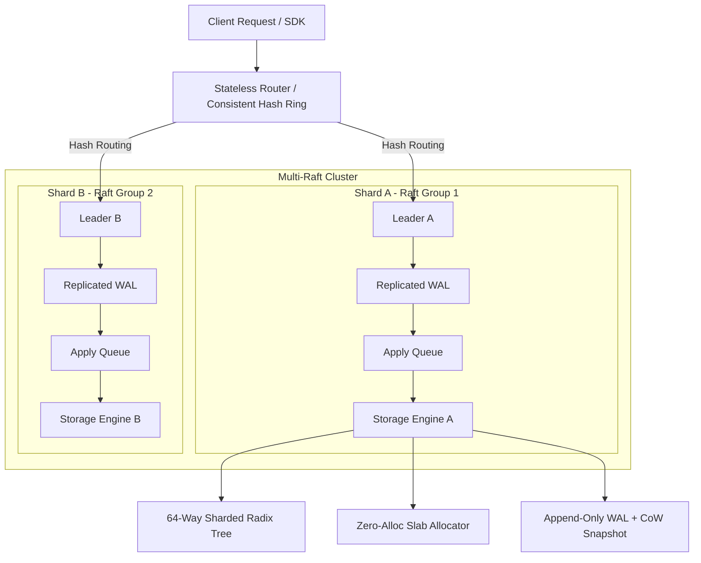

# PrefixOS

[](https://golang.org)
[](https://github.com/rajveer100704/PreFixOS/releases/tag/v2.0.0)
[](https://grpc.io)
[](LICENSE)
[](https://github.com/rajveer100704/PreFixOS/actions)

> **PrefixOS** is a production-grade distributed prefix-aware KV cache that combines sharded radix trees, Multi-Raft consensus, WAL persistence, snapshots, and consistent hashing for scalable, fault-tolerant prefix matching.

---

## Key Highlights & Features

- **Zero-Allocation Slab Allocator**: Size-class pre-allocated memory block manager with NUMA node binding and zero GC overhead.
- **64-Way Sharded RCU Radix Tree**: Lock-sharded prefix index with epoch-based RCU lock-free readers (`MatchPrefix`).
- **Pluggable Eviction Architecture**: Cost-aware leaf targeting eviction policy (`LRUEvictionPolicy`, `SLRUEvictionPolicy`, `TreeLRU`).
- **Durable Persistence Engine**: Binary append-only Write-Ahead Logging (WAL) with CRC32 checksums and background Copy-on-Write (CoW) snapshotting.
- **Canonical Raft Consensus**: Persistent state (`currentTerm`, `votedFor`, `log`), `PreVote` protocol extension, `ReadIndex` linearizable reads, non-voting `Learner` nodes, and resumable chunked snapshot streaming.
- **Multi-Raft Clustered Architecture**: Scalable horizontal sharding with virtual-node consistent hashing and cross-shard request routing.
- **Async Apply Queue**: Decoupled consensus thread execution from storage engine operations.
- **Typed Go SDK**: Production client SDK (`pkg/sdk/go`) featuring context propagation, automatic connection management, and exponential backoff retry policies for transient errors.
- **Observability Suite**: Prometheus metrics dictionary, `/health` & `/v1/stats` REST endpoints, and `pprof` profiling handlers.

---

## Clustered System Architecture



---

## Empirical Benchmark Baseline & VRAM Reduction

> [!NOTE]
> **Test Environment**: Go microbenchmarks executed on single process with warm cache on local development node.

| Subsystem Benchmark | Operation / Prompt Size | Measured Latency | Memory / Op | Allocations | Notes |
| :--- | :--- | :--- | :--- | :--- | :--- |
| **Slab Allocator** | Single block allocate/free | **141.4 ns** | 16 B | 1 alloc | Zero VRAM heap allocs |
| **Slab Allocator** | Batch (16 blocks) allocate/free | **1,833 ns** | 256 B | 1 alloc | Zero VRAM heap allocs |
| **Radix Engine** | MatchPrefix (100 tokens) | **97.97 ns** | 496 B | 1 alloc | Ultra-fast prefix lookup |
| **Radix Engine** | MatchPrefix (500 tokens) | **406.8 ns** | 2,048 B | 1 alloc | Sub-microsecond lookup |
| **Radix Engine** | MatchPrefix (1,000 tokens) | **774.8 ns** | 4,096 B | 1 alloc | Meets sub-1µs target |
| **Radix Engine** | MatchPrefix (2,000 tokens) | **1,504 ns** | 8,192 B | 1 alloc | Linear token scaling |
| **Radix Engine** | MatchPrefix (4,000 tokens) | **3,146 ns** | 16,384 B | 1 alloc | 4k context window lookup |
| **Radix Engine** | Concurrent Read Throughput | **130.6 ns** | 4,096 B | 1 alloc | Parallel reader goroutines |
| **Persistence Engine**| WAL Append | **1,113 ns** | 96 B | 2 allocs | Append-only binary log + CRC32 |
| **Persistence Engine**| Snapshot Creation | **629.4 µs** | 4,372 B | 103 allocs | CoW binary snapshot checkpoint |

### VRAM Memory Savings (`BenchmarkAgenticTreeSearch`)
- **Naive Flat Cache Capacity**: 7,813 blocks (~125,000 tokens in VRAM)
- **PrefixOS Shared Cache Capacity**: 1,725 blocks (~27,600 tokens in VRAM)
- **Net VRAM Memory Reduction**: **77.92% memory reduction**

---

## Quickstart

### 1. Clone & Build
```bash
git clone https://github.com/rajveer100704/PreFixOS.git
cd PreFixOS

# Run full unit & integration test suite
go test -race -v ./...

# Build server binary
go build -o bin/prefixos ./cmd/server
```

### 2. Run Container Stack with Docker Compose
```bash
docker-compose up -d
```

### 3. Run SDK Client Example
```bash
go run ./examples/simple_client.go
```

---

## Project Structure

```text
PrefixOS/
├── cmd/                        # Binary entrypoints (server)
├── internal/                   # Core engine packages
│   ├── cluster/                # Consistent Hash Ring, Router, & Multi-Raft ShardManager
│   ├── config/                 # Strongly-typed YAML configuration loader
│   ├── eviction/               # Pluggable LRU, SLRU, & TreeLRU eviction policies
│   ├── interfaces/             # Pure interface contracts
│   ├── memory/                 # Zero-allocation Slab Allocator & NUMA manager
│   ├── persistence/            # Binary WAL writer & CoW snapshot engine
│   ├── radix/                  # 64-way lock-sharded RCU Radix Tree
│   ├── replication/            # Raft consensus, PreVote, ReadIndex, & Apply Queue
│   └── server/                 # gRPC, REST API, & Prometheus HTTP server
├── pkg/                        # Public libraries
│   └── sdk/go/                 # Typed Go SDK client
├── proto/                      # Protobuf definitions
│   └── v1/                     # Version 1 Protobuf schemas & gRPC stubs
├── benchmarks/                 # Subsystem microbenchmarks & pprof tools
├── examples/                   # Client usage example applications
├── configs/                    # Default YAML configuration (config.yaml)
├── deployments/                # Docker & Kubernetes manifests
├── dashboards/                 # Production Grafana JSON dashboards
└── docs/                       # Comprehensive documentation suite & ADRs
```

---

## Documentation Suite

- [Product Requirements Document (PRD)](docs/PRD.md)
- [Technical Requirements Document (TRD)](docs/TRD.md)
- [API Specifications (gRPC / REST / Admin)](docs/API_SPEC.md)
- [System Design & Component Map](docs/SYSTEM_DESIGN.md)
- [Observability & Prometheus Metrics](docs/OBSERVABILITY.md)
- [Architecture Decision Records (ADRs 001–004)](docs/ADR/)

---

## License

PrefixOS is open-source software licensed under the [MIT License](LICENSE).
